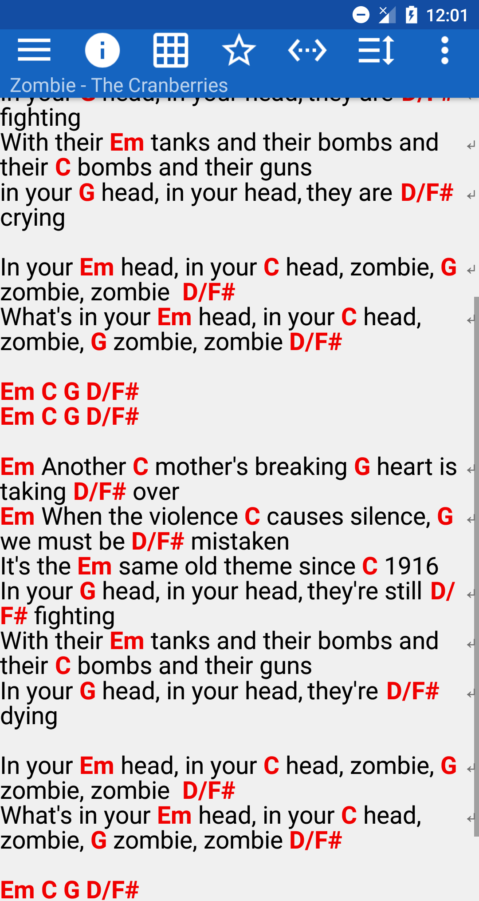
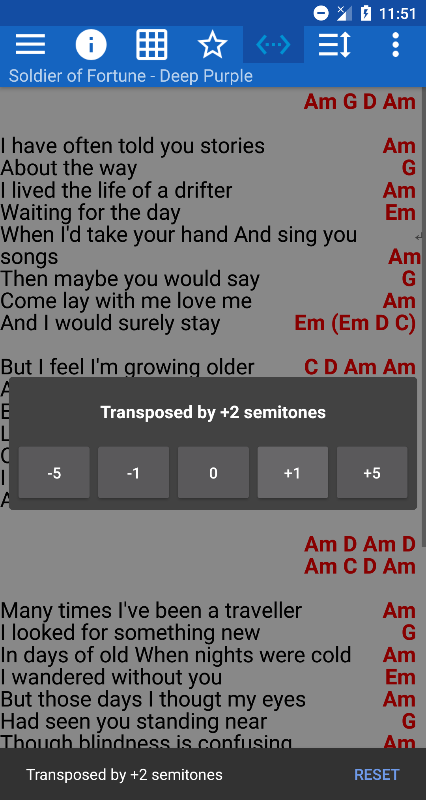
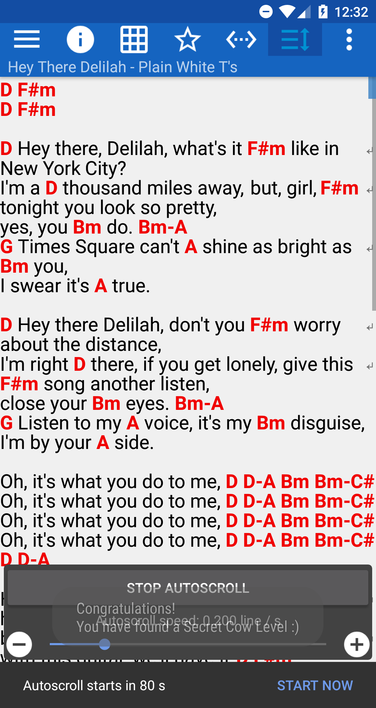
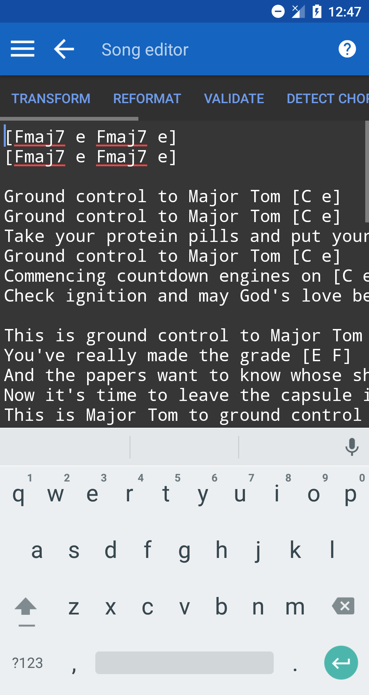
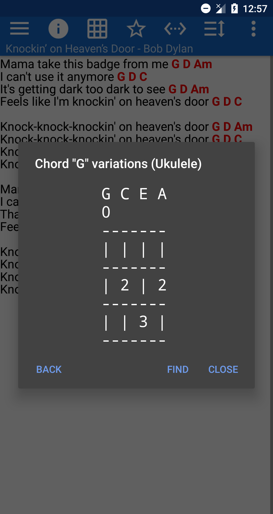
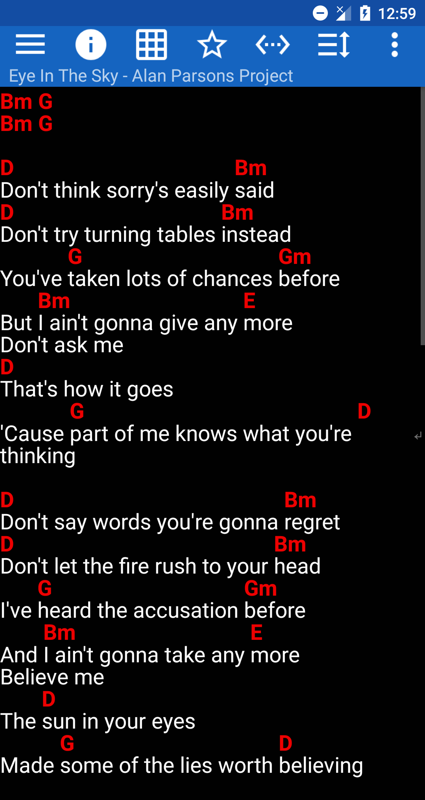
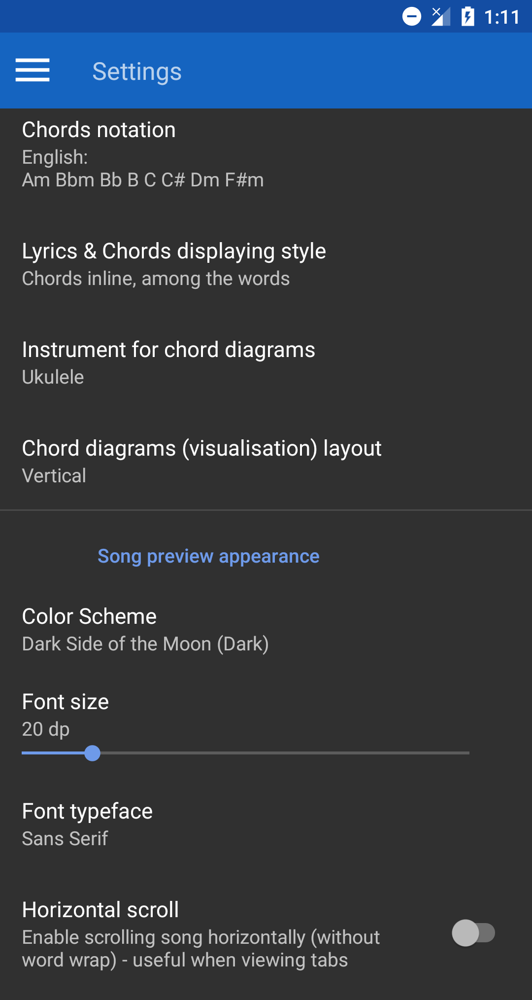
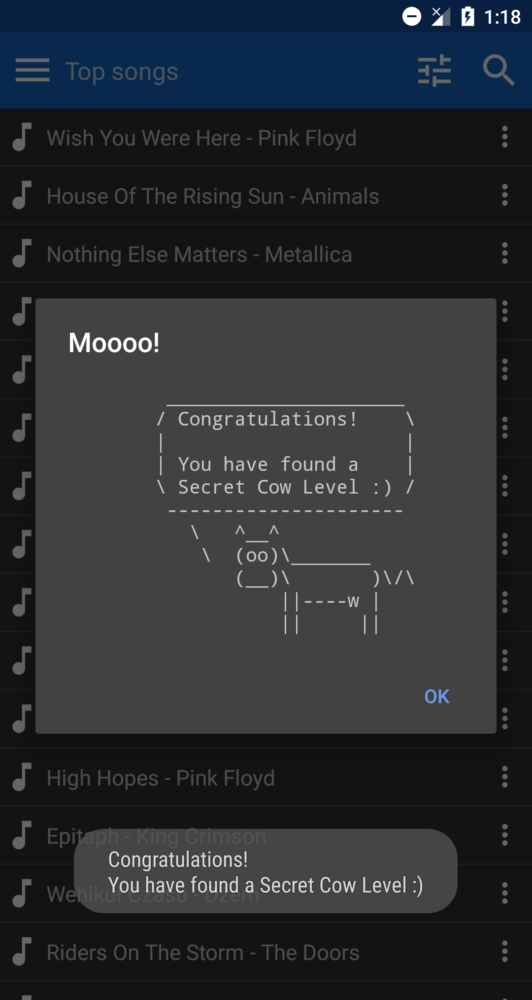

# Songbook

Song lyrics viewer with chords to play on guitar, piano and sing

## Features
Our chief weapons are:

- Highlighting chords
- Chords transposition (any song to any key)
- Auto scrolling while playing
- Custom songs and chords editor
- Playlists
- Chord diagrams for guitar, ukulele, mandolin and piano
- Song Cast protocol - Sharing & Displaying songs on many devices over Internet connection
- Several chord notations: English (`Am Bbm Bb B C Dm`), German (`a b B H C d`), Solfege, Dutch, Japanese
- Recognizing the key of the song
- Automatic chords detection
- Different chord displaying styles
- Custom songs & settings synchronization between many devices, back-ups & restoring all application data
- Editing synchronized songs in the Web Editor
- Sharing songs by link
- Always-on display while playing
- Importing & Exporting songs from / to files or Google Drive
- Controls with keyboard arrow keys, D-pad, headset button or external pedal

Songbook is a tool focused on guitarists, pianists and other musicians, but it also can be used just to view the songs lyrics on mobile devices.
It has many songs with chords on board and its database can be easily extended with your own songs.

## Demo

Example application screenshots:

|  |  |
|---|---|
|  |  |
|  |  |
|  |  |

## Available on Google Play

*Songbook* is available on [Google Play](https://play.google.com/store/apps/details?id=igrek.songbook) for free.
Please give it a ⭐️⭐️⭐️⭐️⭐️ star.

It is available on **phones**, **tablets** and **TV** devices with **Android**.

## Manual

Find out more user guides and manuals at [https://igrek51.github.io/android-songbook](https://igrek51.github.io/android-songbook).

## About

This software is published under the [GNU General Public License v3.0](./LICENSE).
See [Copyright Notices](./docs/pages/develop/copyright-notices.md).
